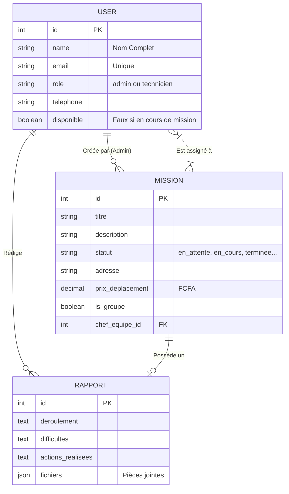
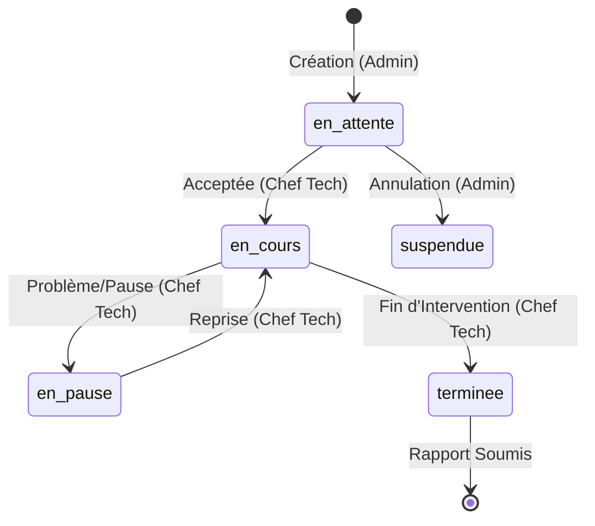

# 📘 Documentation Officielle : SAV Mikem Technologie

Bienvenue dans la documentation complète de l'application web de gestion d'interventions **SAV Mikem Technologie**. Ce document est conçu pour les développeurs, administrateurs système et professionnels de l'informatique souhaitant comprendre, maintenir ou faire évoluer l'architecture logicielle.

---

## 🏗️ 1. Architecture Générale

Le projet est construit sur une architecture moderne de type **MVC (Modèle-Vue-Contrôleur)** avec le framework PHP le plus robuste du marché.

- **Backend / Framework** : Laravel 10 (PHP 8.1+)
- **Base de données** : MySQL / MariaDB (via WAMP / Laragon)
- **Frontend** : Laravel Blade (Moteur de templates) + CSS natif personnalisé.
- **Icônes** : LineAwesome (CDN léger remplaçant FontAwesome).
- **Génération PDF** : `barryvdh/laravel-dompdf`
- **Mailing** : Pilote SMTP intégré Laravel.

---

## ⚙️ 2. Schéma de Base de Données (MCD)

La base de données repose sur trois entités fondamentales et une table de liaison pour la gestion multi-techniciens :

---

## 👥 3. Rôles et Workflow (Processus Métier)

Le cœur de l'application repose sur un système de droits hiérarchiques stricts.

### 🛡️ L'Administrateur (`role: admin`)
Il a la vision globale et le pouvoir décisionnel.
- Création, édition et suppression des Missions (Tant qu'elles sont "En attente").
- Paramétrage de la prime de déplacement de la mission en FCFA.
- Création et gestion des comptes Techniciens.
- **Facturation** : L'administrateur a accès au générateur **PDF Financier** sur la fiche du technicien, résumant l'historique complet des gains liés aux déplacements.
- **Verrous** : L'admin est bloqué algorithmiquement s'il essaie de modifier ou supprimer une mission entamée ou "Terminée".

### 🔧 Le Technicien (`role: technicien`)
Ses droits dépendent de la nature de la mission à laquelle il est assigné.

1. **Membre Standard ("Spectateur")** :
   - Peut visualiser la mission.
   - Si la mission est terminée, il ne voit qu'un message d'attente *"En attente du rapport"*, et une fois ce dernier rédigé par le chef, il le consulte en lecture seule (format PDF de compte-rendu textuel).
   
2. **Le Chef d'Équipe (ou Technicien Solo)** :
   - Est désigné automatiquement par l'Admin (via le menu déroulant à la création de la mission).
   - Possède le bouton magique pour passer la mission **En cours**, **En pause**, ou **Terminée**.
   - **Exclusivité** : Il est le seul habilité à soumettre le **Rapport Final** de l'intervention, avec possibilité d'ajouter des fichiers (photos du chantier, bons de commande...).

#### 🚀 Le Cycle de vie d'une Mission (State Machine)

---

## 🔒 4. Sécurité & Protections Actives
L'application embarque des garde-fous pour que la gestion soit impénétrable aux erreurs de clics :
- **Protection Anti-Doublon** : Un technicien ne peut *pas* accepter ni démarrer une nouvelle mission s'il possède déjà une mission au statut `en_cours` ou `en_pause`. Une alerte lui demandera de d'abord achever sa tâche actuelle.
- **Bloquage de statut HTTP (Middleware)** : Le dossier `app/Http/Middleware/CheckRole.php` empêche formellement un technicien de charger l'URL d'une page réservée à l'administrateur, et le renvoie sur son propre dashboard.

---

## ✉️ 5. Moteur de Notification (Email)
Lorsqu'un administrateur affecte une équipe à un dépannage, Laravel compile en arrière-plan le fichier `resources/views/emails/mission-assignee.blade.php`. 
- Il initie une connexion selon les variables configurées dans le `.env` (Ex: `smtp.gmail.com`).
- Transmet les coordonnées complètes, le nom du client, l'adresse du lieu et l'envoi du prix de déplacement en mode crypté (TLS).

---

## 💻 6. Répertoires Clés (Pour le Développeur)

Si vous devez faire une mise à jour manuelle ou passer la main à un autre développeur, voici la topographie :

- 📂 `app/Http/Controllers/Admin` → Logique backend de la partie Direction.
- 📂 `app/Http/Controllers/Technicien` → Logique backend de la partie Ouvrière.
- 📂 `resources/views/` → Architecture HTML (Blade) contenant le design visuel "Premium Dark/Glass" que vous avez dans `layouts/` et les sous-dossiers respectifs.
- 📂 `public/css/app.css` → Le système nerveux de l'esthétique. Toutes les variables de couleurs, les effets de verre (Glassmorphism) s'y trouvent.
- 📂 `routes/web.php` → La carte du réseau. Toutes les adresses web (URLs) sont paramétrées ici.

*(Document généré automatiquement à la fin de la Version V4).*
