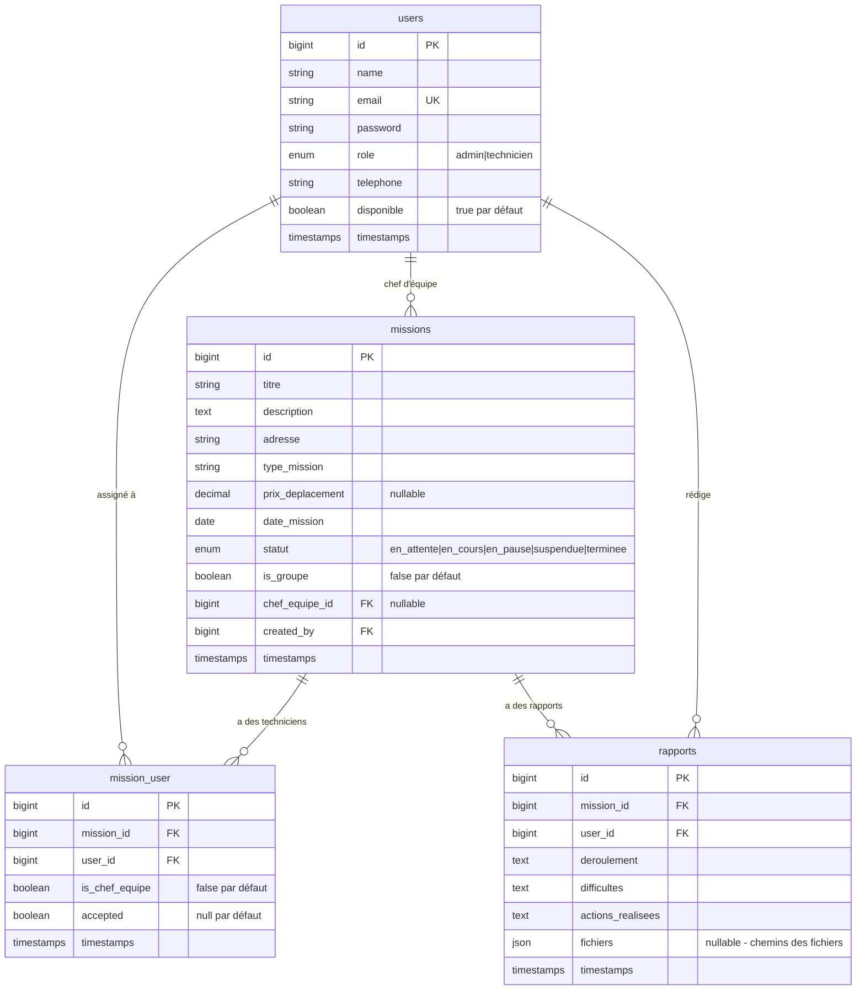

# Application de Gestion des Missions SAV

Application web Laravel + MySQL pour la gestion et le suivi des missions d'intervention technique.

## User Review Required

> **Prérequis à vérifier sur votre machine** :
> - PHP >= 8.2 avec extensions (mbstring, xml, pdo_mysql, zip, curl)
> - Composer
> - Node.js >= 18 + npm
> - MySQL >= 8.0 ou MariaDB >= 10.6
> - Si vous utilisez XAMPP, WAMP ou Laragon, confirmez-le.

---

## Architecture du Projet

```
c:\Users\Amiral\Documents\Mikem\
├── app/
│   ├── Http/
│   │   ├── Controllers/
│   │   │   ├── Admin/
│   │   │   │   ├── DashboardController.php
│   │   │   │   ├── MissionController.php
│   │   │   │   └── TechnicienController.php
│   │   │   ├── Technicien/
│   │   │   │   ├── DashboardController.php
│   │   │   │   ├── MissionController.php
│   │   │   │   └── RapportController.php
│   │   │   └── Auth/
│   │   │       └── LoginController.php
│   │   ├── Middleware/
│   │   │   ├── AdminMiddleware.php
│   │   │   └── TechnicienMiddleware.php
│   │   └── Requests/
│   │       ├── MissionRequest.php
│   │       └── RapportRequest.php
│   ├── Models/
│   │   ├── User.php
│   │   ├── Mission.php
│   │   ├── MissionUser.php
│   │   └── Rapport.php
│   └── Providers/
├── database/
│   ├── migrations/
│   │   ├── create_users_table.php
│   │   ├── create_missions_table.php
│   │   ├── create_mission_user_table.php
│   │   └── create_rapports_table.php
│   └── seeders/
│       └── AdminSeeder.php
├── resources/
│   └── views/
│       ├── layouts/
│       │   ├── admin.blade.php
│       │   └── technicien.blade.php
│       ├── auth/
│       │   └── login.blade.php
│       ├── admin/
│       │   ├── dashboard.blade.php
│       │   ├── missions/
│       │   │   ├── index.blade.php
│       │   │   ├── create.blade.php
│       │   │   ├── edit.blade.php
│       │   │   └── show.blade.php
│       │   └── techniciens/
│       │       ├── index.blade.php
│       │       └── show.blade.php
│       └── technicien/
│           ├── dashboard.blade.php
│           ├── missions/
│           │   ├── index.blade.php
│           │   └── show.blade.php
│           ├── rapports/
│           │   ├── create.blade.php
│           │   └── show.blade.php
│           └── historique.blade.php
├── public/
│   └── css/
│       └── app.css
├── routes/
│   └── web.php
└── .env
```

---

## Schéma de Base de Données



---

## Proposed Changes

### 1. Initialization & Configuration

#### [NEW] Projet Laravel complet
- Création de tous les fichiers de configuration Laravel
- Fichier `.env.example` pré-configuré pour MySQL
- Instructions d'installation dans `INSTALL.md`

---

### 2. Base de Données (Migrations & Seeders)

#### [NEW] database/migrations/
- `create_users_table` : Table users avec rôle (admin/technicien), téléphone, disponibilité
- `create_missions_table` : Missions avec tous les champs requis + statuts enum
- `create_mission_user_table` : Table pivot pour assignation groupe
- `create_rapports_table` : Rapports avec champs texte + fichiers JSON

#### [NEW] database/seeders/AdminSeeder.php
- Crée un compte admin par défaut (admin@sav.com / password)

---

### 3. Modèles & Relations

#### [NEW] app/Models/
- **User** : Relations avec missions (belongsToMany), rapports (hasMany), scope par rôle
- **Mission** : Relations avec users, rapports, chef d'équipe, statuts colorés
- **Rapport** : Relations avec mission et user, gestion fichiers

---

### 4. Authentification & Middleware

#### [NEW] app/Http/Controllers/Auth/LoginController.php
- Login/Logout sécurisé
- Redirection selon le rôle (admin → dashboard admin, technicien → dashboard technicien)

#### [NEW] app/Http/Middleware/
- **AdminMiddleware** : Vérifie que l'utilisateur est admin
- **TechnicienMiddleware** : Vérifie que l'utilisateur est technicien

---

### 5. Partie Admin

#### [NEW] app/Http/Controllers/Admin/DashboardController.php
- Statistiques globales : nombre de missions, en cours, terminées
- Liste des techniciens disponibles
- Graphique de répartition des statuts

#### [NEW] app/Http/Controllers/Admin/MissionController.php
- CRUD complet des missions
- Assignation individuelle ou groupe
- Désignation chef d'équipe
- Gestion des statuts avec code couleur
- Vue détaillée avec rapport du technicien et fichiers joints

#### [NEW] app/Http/Controllers/Admin/TechnicienController.php
- Liste des techniciens avec filtre de disponibilité
- Création de techniciens (ajout de comptes)
- Vue détaillée avec missions assignées

---

### 6. Partie Technicien

#### [NEW] app/Http/Controllers/Technicien/DashboardController.php
- Missions assignées avec statuts
- Actions rapides

#### [NEW] app/Http/Controllers/Technicien/MissionController.php
- Liste des missions assignées
- Détails : adresse, description, équipe, chef
- Accepter mission (si chef d'équipe)
- Mettre à jour statut (en cours, pause, terminée)

#### [NEW] app/Http/Controllers/Technicien/RapportController.php
- Formulaire de rapport post-mission
- Upload de fichiers/images
- Historique des missions/rapports

---

### 7. Interface Utilisateur (Views Blade + CSS)

#### Design System
- **Palette** : Bleu profond (#1a1a2e), Accent (#e94560), Surfaces (#16213e, #0f3460)
- **Typographie** : Inter (Google Fonts)
- **Composants** : Cards avec glassmorphism, badges colorés pour statuts, sidebar navigation
- **Animations** : Transitions fluides, hover effects, micro-animations
- **Responsive** : Mobile-first, sidebar collapse, cards adaptatives

#### Statuts - Code Couleur
| Statut | Couleur | Badge |
|--------|---------|-------|
| En attente | 🟡 Jaune (#ffc107) | `badge-warning` |
| En cours | 🔵 Bleu (#2196f3) | `badge-info` |
| En pause | 🟠 Orange (#ff9800) | `badge-pause` |
| Suspendue | 🔴 Rouge (#f44336) | `badge-danger` |
| Terminée | 🟢 Vert (#4caf50) | `badge-success` |

---

### 8. Routes

```php
// Auth
Route::get('/login', [LoginController::class, 'showLoginForm']);
Route::post('/login', [LoginController::class, 'login']);
Route::post('/logout', [LoginController::class, 'logout']);

// Admin
Route::prefix('admin')->middleware(['auth', 'admin'])->group(function () {
    Route::get('/dashboard', [AdminDashboardController::class, 'index']);
    Route::resource('missions', AdminMissionController::class);
    Route::resource('techniciens', TechnicienController::class);
    Route::patch('/missions/{mission}/statut', [AdminMissionController::class, 'updateStatut']);
});

// Technicien
Route::prefix('technicien')->middleware(['auth', 'technicien'])->group(function () {
    Route::get('/dashboard', [TechDashboardController::class, 'index']);
    Route::get('/missions', [TechMissionController::class, 'index']);
    Route::get('/missions/{mission}', [TechMissionController::class, 'show']);
    Route::patch('/missions/{mission}/accept', [TechMissionController::class, 'accept']);
    Route::patch('/missions/{mission}/statut', [TechMissionController::class, 'updateStatut']);
    Route::get('/missions/{mission}/rapport', [RapportController::class, 'create']);
    Route::post('/missions/{mission}/rapport', [RapportController::class, 'store']);
    Route::get('/historique', [TechMissionController::class, 'historique']);
});
```

---

## Open Questions

> [!IMPORTANT]
> **1. Environnement de développement** : Utilisez-vous XAMPP, WAMP, Laragon, ou PHP/Composer installés directement ? Cela m'aidera à adapter les instructions d'installation.

> [!IMPORTANT]
> **2. Nom de la base de données** : Quel nom souhaitez-vous pour la base MySQL ? (ex: `sav_missions`)

> [!NOTE]
> **3. Google Maps** : L'intégration Google Maps est marquée optionnelle. Souhaitez-vous l'inclure dès la V1 ? (nécessite une clé API Google Maps)

> [!NOTE]
> **4. Notifications** : Souhaitez-vous des notifications par email lors de l'assignation d'une mission ?

---

## Verification Plan

### Installation (à faire par vous)
```bash
# 1. Se placer dans le dossier du projet
cd c:\Users\Amiral\Documents\Mikem

# 2. Installer les dépendances PHP
composer install

# 3. Copier le fichier d'environnement
copy .env.example .env

# 4. Générer la clé d'application
php artisan key:generate

# 5. Configurer la base de données dans .env
# DB_DATABASE=sav_missions
# DB_USERNAME=root
# DB_PASSWORD=

# 6. Créer la base de données MySQL
# Via phpMyAdmin ou : mysql -u root -e "CREATE DATABASE sav_missions;"

# 7. Exécuter les migrations et seeders
php artisan migrate --seed

# 8. Créer le lien symbolique pour le storage
php artisan storage:link

# 9. Lancer le serveur de développement
php artisan serve
```

### Tests manuels
- Connexion admin avec `admin@sav.com` / `password`
- Création d'un technicien
- Création d'une mission individuelle et groupe
- Assignation de techniciens
- Connexion technicien et vérification du dashboard
- Acceptation et mise à jour de statut
- Rédaction d'un rapport avec upload de fichiers
- Vérification responsive sur mobile
